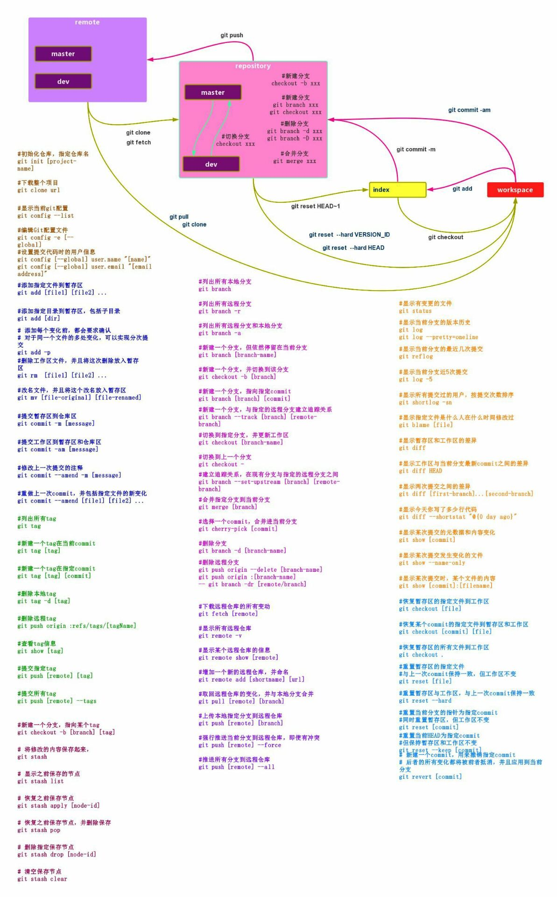

# git使用方法

## git是什么？  
&emsp;&emsp;Git是目前世界上最先进的分布式版本控制系统。  

## SVN与Git的最主要的区别？
&emsp;&emsp;SVN是集中式版本控制系统，版本库是集中放在中央服务器的，而干活的时候，用的都是自己的电脑，所以首先要从中央服务器哪里得到最新的版本，然后干活，干完后，需要把自己做完的活推送到中央服务器。集中式版本控制系统是必须联网才能工作，如果在局域网还可以，带宽够大，速度够快，如果在互联网下，如果网速慢的话，就纳闷了。  
&emsp;&emsp;Git是分布式版本控制系统，那么它就没有中央服务器的，每个人的电脑就是一个完整的版本库，这样，工作的时候就不需要联网了，因为版本都是在自己的电脑上。既然每个人的电脑都有一个完整的版本库，那多个人如何协作呢？比如说自己在电脑上改了文件A，其他人也在电脑上改了文件A，这时，你们两之间只需把各自的修改推送给对方，就可以互相看到对方的修改了。  

## 如何操作？  
### 创建版本库  
&emsp;&emsp;什么是版本库？版本库又名仓库，英文名repository,你可以简单的理解一个目录，这个目录里面的所有文件都可以被Git管理起来，每个文件的修改，删除，Git都能跟踪，以便任何时刻都可以追踪历史，或者在将来某个时刻还可以将文件”还原”。  
1. 进入用于创建仓库的目录
2. 通过命令 git init 把这个目录变成git可以管理的仓库
3. 把文件添加到版本库中：
    + 在仓库目录下新建文件or目录
    + 使用命令 git add "文件" 添加到暂存区里面去
    + 用命令 git commit告诉Git，把文件一次性提交到仓库（分支），参数 -m 用来添加备注信息
    + 通过命令git status来查看是否还有文件未提交
    + 通过命令git diff “文件” 查看文件修改的内容  

### 版本回退  
1. 改变HEAD指向
    + 使用命令 git log查看下历史记录  
    + 使用git reset  --hard HEAD^回到上一个版本  
    + 使用git reset  --hard HEAD^^ 回到上上个版本  
    + 使用git reset  --hard HEAD~N回到前N个版本  
2. 通过版本号
    + 通过git reflog 命令获取版本号  
    + 通过git reset  --har “版本号” 命令回退  

### 如何理解工作区与暂存区的区别？
&emsp;&emsp;工作区：就是你在电脑上看到的目录，比如目录下testgit里的文件(.git隐藏目录版本库除外)。或者以后需要再新建的目录文件等等都属于工作区范畴。  
&emsp;&emsp;版本库(Repository)：工作区有一个隐藏目录.git,这个不属于工作区，这是版本库。其中版本库里面存了很多东西，其中最重要的就是stage(暂存区)，还有Git为我们自动创建了第一个分支master,以及指向master的一个指针HEAD。  
**我们前面说过使用Git提交文件到版本库有两步：**  
  + 第一步：是使用 git add 把文件添加进去，实际上就是把文件添加到暂存区。  
  + 第二步：使用git commit提交更改，实际上就是把暂存区的所有内容提交到当前分支上。   

### git撤销修改和删除文件操作
**撤销修改：**
  + 第一：如果我知道要删掉那些内容的话，直接手动更改去掉那些需要的文件，然后add添加到暂存区，最后commit掉。
  + 第二：我可以按以前的方法直接恢复到上一个版本。使用 git reset  --hard HEAD^。
  + 第三：用git checkout  -- “文件” 命令丢弃工作区修改。  
  **使用git checkout 命令把工作区做的修改全部撤销有两种情况:**
    1. 文件自动修改后，还没有放到暂存区，使用 撤销修改就回到和版本库一模一样的状态。
    2. 另外一种是文件已经放入暂存区，接着又作修改，撤销修改就回到添加暂存区后的状态。  
**注意：命令git checkout -- “文件” 中的 -- 很重要，如果没有 -- 的话，那么命令变成创建分支了。**

**删除文件：**  
&emsp;&emsp;一般情况下，可以直接在文件目录中把文件删了，或者使用如上rm命令：rm b.txt ，如果我想彻底从版本库中删掉了此文件的话，可以再执行commit命令提交。  
&emsp;&emsp;如果没有commit之前，想在版本库中恢复此文件可以使用命令 git checkout  -- b.txt来恢复。

## 远程仓库  
&emsp;&emsp;先注册github账号，由于你的本地Git仓库和github仓库之间的传输是通过SSH加密的，所以需要一点设置：
  + 第一步：创建SSH Key。在用户主目录下，看看有没有.ssh目录，如果有，再看看这个目录下有没有id_rsa和id_rsa.pub这两个文件，如果有的话，直接跳过此如下命令，如果没有的话，打开命令行，输入如下命令：  
    ```
    ssh-keygen  -t rsa –C “youremail@example.com”
    ```  
&emsp;&emsp;**注意：id_rsa是私钥，不能泄露出去，id_rsa.pub是公钥，可以放心地告诉任何人。**
  + 第二步：登录github,打开” settings”中的SSH Keys页面，然后点击“Add SSH Key”,填上任意title，在Key文本框里黏贴id_rsa.pub文件的内容。

### 如何添加远程库？
&emsp;&emsp;现在的情景是：我们已经在本地创建了一个Git仓库后，又想在github创建一个Git仓库，并且希望这两个仓库进行远程同步，这样github的仓库可以作为备份，又可以其他人通过该仓库来协作。  
&emsp;&emsp;首先，登录github上，然后在右上角找到“create a new repo”创建一个新的仓库。  
&emsp;&emsp;目前，在GitHub上的这个testgit仓库还是空的，GitHub告诉我们，可以从这个仓库克隆出新的仓库，也可以把一个已有的本地仓库与之关联，然后，把本地仓库的内容推送到GitHub仓库。  
&emsp;&emsp;现在，我们根据GitHub的提示，在本地的testgit仓库下运行命令： 
```
    git remote add origin https://github.com/tugenhua0707/仓库名
```  
&emsp;&emsp;把本地库的内容推送到远程，使用 git push命令，实际上是把当前分支master推送到远程。  
&emsp;&emsp;从现在起，只要本地作了提交，就可以通过如下命令：  
```
    git push origin master
```  
&emsp;&emsp;把本地master分支的最新修改推送到github上了，现在你就拥有了真正的分布式版本库了。  
### 如何从远程库克隆？  
&emsp;&emsp;上面我们了解了先有本地库，后有远程库时候，如何关联远程库。  
&emsp;&emsp;现在我们想，假如远程库有新的内容了，我想克隆到本地来 如何克隆呢？  
&emsp;&emsp;使用命令git clone [url] 从远程仓库克隆一个本地库。  
  
### 创建与合并分支
&emsp;&emsp;在版本回填退里，你已经知道，每次提交，Git都把它们串成一条时间线，这条时间线就是一个分支。截止到目前，只有一条时间线，在Git里，这个分支叫主分支，即master分支。HEAD严格来说不是指向提交，而是指向master，master才是指向提交的，所以，HEAD指向的就是当前分支。  
&emsp;&emsp;首先，我们来创建dev分支，然后切换到dev分支上。如下操作：  
```
  git checkout 命令加上 –b参数表示创建并切换，相当于如下2条命令
  git branch dev
  git checkout dev
  git branch查看分支，会列出所有的分支，当前分支前面会添加一个星号
  然后在新建的dev分支上添加文件
  最后切回主分支master上

  现在我们可以把dev分支上的内容合并到分支master上，在master分支上，使用命令：
  git merge dev 
  git merge命令用于合并指定分支到当前分支上

  总结创建与合并分支命令如下：
    查看分支：git branch
    创建分支：git branch name
    切换分支：git checkout name
    创建+切换分支：git checkout –b name
    合并某分支到当前分支：git merge name
    删除分支：git branch –d name
```

## 常见问题
### 如何解决冲突？
&emsp;&emsp;Git用<<<<<<<，=======，>>>>>>>标记出不同分支的内容，其中<<<HEAD是指主分支修改的内容，>>>>>fenzhi1 是指fenzhi1上修改的内容。修改代码跟主分支上一样。
### 分支管理策略
&emsp;&emsp;通常合并分支时，git一般使用”Fast forward”模式，在这种模式下，删除分支后，会丢掉分支信息，现在我们来使用带参数 –no-ff来禁用”Fast forward”模式。  
&emsp;&emsp;首先我们来做demo演示下：  
&emsp;&emsp;&emsp;&emsp;创建一个dev分支。  
&emsp;&emsp;&emsp;&emsp;修改readme.txt内容。  
&emsp;&emsp;&emsp;&emsp;添加到暂存区。  
&emsp;&emsp;&emsp;&emsp;切换回主分支(master)。  
&emsp;&emsp;&emsp;&emsp;合并dev分支，使用命令 git merge –no-ff  -m “注释” dev  
&emsp;&emsp;&emsp;&emsp;查看历史记录  
&emsp;&emsp;分支策略：首先master主分支应该是非常稳定的，也就是用来发布新版本，一般情况下不允许在上面干活，干活一般情况下在新建的dev分支上干活，干完后，比如上要发布，或者说dev分支代码稳定后可以合并到主分支master上来。  

### bug分支
&emsp;&emsp;在开发中，会经常碰到bug问题，那么有了bug就需要修复，在Git中，分支是很强大的，每个bug都可以通过一个临时分支来修复，修复完成后，合并分支，然后将临时的分支删除掉。  
&emsp;&emsp;比如我在开发中接到一个404 bug时候，我们可以创建一个404分支来修复它，但是，当前的dev分支上的工作还没有提交。并不是我不想提交，而是工作进行到一半时候，我们还无法提交，比如我这个分支bug要2天完成，但是我issue-404 bug需要5个小时内完成。怎么办呢？还好，Git还提供了一个stash功能，可以把当前工作现场 ”隐藏起来”，等以后恢复现场后继续工作。  
```
  git stash 《隐藏工作现场》
```
&emsp;&emsp;所以现在我可以通过创建issue-404分支来修复bug了。  
&emsp;&emsp;首先我们要确定在那个分支上修复bug，比如我现在是在主分支master上来修复的，现在我要在master分支上创建一个临时分支。修复完成后，切换到master分支上，并完成合并，最后删除issue-404分支。  
&emsp;&emsp;现在，我们回到dev分支上干活了。  
&emsp;&emsp;隐藏工作现场后，工作区是干净的，那么我们工作现场去哪里呢？我们可以使用命令git stash list来查看下。  
&emsp;&emsp;工作现场还在，Git把stash内容存在某个地方了，但是需要恢复一下，可以使用如下2个方法：  
&emsp;&emsp; 1. git stash apply恢复，恢复后，stash内容并不删除，你需要使用命令git stash drop来删除。  
&emsp;&emsp; 2. 另一种方式是使用git stash pop,恢复的同时把stash内容也删除了。  

## 多人协作
&emsp;&emsp;当你从远程库克隆时候，实际上Git自动把本地的master分支和远程的master分支对应起来了，并且远程库的默认名称是origin。  
&emsp;&emsp;要查看远程库的信息 使用 git remote  
&emsp;&emsp;要查看远程库的详细信息 使用 git remote –v  
### 推送分支
&emsp;&emsp;推送分支就是把该分支上所有本地提交到远程库中，推送时，要指定本地分支，这样，Git就会把该分支推送到远程库对应的远程分支上：  
```
  使用命令：git push origin master
```
&emsp;&emsp;那么一般情况下，那些分支要推送呢？  
&emsp;&emsp;master分支是主分支，因此要时刻与远程同步。   
&emsp;&emsp;一些修复bug分支不需要推送到远程去，可以先合并到主分支上，然后把主分支master推送到远程去。  
### 抓取分支  
&emsp;&emsp;多人协作时，大家都会往master分支上推送各自的修改。  
&emsp;&emsp;现在我们的同事要在dev分支上做开发，就必须把远程的origin的dev分支到本地来，于是可以使用命令创建本地dev分支：  
```
  git checkout  –b dev origin/dev  
```
&emsp;&emsp;现在同事们就可以在dev分支上做开发了，开发完成后把dev分支推送到远程库上。
同事们已经向origin/dev分支上推送了提交，而我在我的目录文件下也对同样的文件同个地方作了修改，也试图推送到远程库时：推送失败。  
&emsp;&emsp;推送失败是因为我的同事最新提交的和我试图推送的有冲突，解决的办法也很简单，上面已经提示我们，先用git pull把最新的提交从origin/dev抓下来，然后在本地合并，解决冲突，再推送。  
&emsp;&emsp;这回git pull成功，但是合并有冲突，需要手动解决，解决的方法和分支管理中的 解决冲突完全一样。解决后，提交，再push。  
**因此：多人协作工作模式一般是这样的：**  
1. 首先，可以试图用git push origin branch-name推送自己的修改.  
2. 如果推送失败，则因为远程分支比你的本地更新早，需要先用git pull试图合并。  
3. 如果合并有冲突，则需要解决冲突，并在本地提交。再用git push origin branch-name推送。 

## git常用命令
```
　　mkdir：         XX (创建一个空目录 XX指目录名)
　　pwd：          显示当前目录的路径。
　　git init          把当前的目录变成可以管理的git仓库，生成隐藏.git文件。
　　git add XX       把xx文件添加到暂存区去。
　　git commit –m “XX”  提交文件 –m 后面的是注释。
　　git status        查看仓库状态
　　git diff  XX      查看XX文件修改了那些内容
　　git log          查看历史记录
　　git reset  --hard HEAD^ 或者 git reset  --hard HEAD~ 回退到上一个版本
　　(如果想回退到100个版本，使用git reset –hard HEAD~100 )
　　cat XX         查看XX文件内容
　　git reflog       查看历史记录的版本号id
　　git checkout -- XX  把XX文件在工作区的修改全部撤销。
　　git rm XX          删除XX文件
　　git remote add origin https://github.com/tugenhua0707/testgit 关联一个远程库
　　git push –u(第一次要用-u 以后不需要) origin master 把当前master分支推送到远程库
　　git clone https://github.com/tugenhua0707/testgit  从远程库中克隆
　　git checkout –b dev  创建dev分支 并切换到dev分支上
　　git branch  查看当前所有的分支
　　git checkout master 切换回master分支
　　git merge dev    在当前的分支上合并dev分支
　　git branch –d dev 删除dev分支
　　git branch name  创建分支
　　git stash 把当前的工作隐藏起来 等以后恢复现场后继续工作
　　git stash list 查看所有被隐藏的文件列表
　　git stash apply 恢复被隐藏的文件，但是内容不删除
　　git stash drop 删除文件
　　git stash pop 恢复文件的同时 也删除文件
　　git remote 查看远程库的信息
　　git remote –v 查看远程库的详细信息
　　git push origin master  Git会把master分支推送到远程库对应的远程分支上
```
  

<center>...未完待续...</center>  
---  
***  

<link rel="stylesheet" href="https://cdn.jsdelivr.net/npm/gitalk@1/dist/gitalk.css">
<script src="https://cdn.jsdelivr.net/npm/gitalk@1/dist/gitalk.min.js"></script>
<div id="gitalk-container"></div>
<script>
  var gitalk = new Gitalk({
    "clientID": "44d7c96f948be236a8c9",
    "clientSecret": "fb9fb3178db6640131c4e3eb69f9449e42bba661",
    "repo": "blog",
    "owner": "Zhang-jie-jun",
    "admin": ["Zhang-jie-jun"],
    "id": location.pathname,      
    "distractionFreeMode": false  
  });
  gitalk.render("gitalk-container");
</script>
