# map底层原理

## map简介
### map是什么？
map是一堆键值对的未排序集合，类似Python中字典的概念，它的格式为map[keyType]valueType，是一个key-value的hash结构。map的读取和设置也类似slice一样，通过key来操作，只是slice的index只能是int类型，而map多了很多类型，可以是int，可以是string及所有完全定义了==与!=操作的类型。  

在C++/Java中，map一般都以库的方式提供，比如在C++中是STL的std::map<>，在Java中是Hashmap<>，在这些语言中，如果要使用map，事先要引用相应的库。而在Go中，使用map不需要引入任何库，并且用起来也更加方便。  

### map声明
```go
var 变量名 map[int]string // 声明一个key为int类型，值为string类型的map变量，未分配空间
```

### map初始化
```go
test1 := map[int]string {1:"zhang san", 2:"li si", 3:"wang wu"} // 直接初始化
test2 := make(map[int] string)     // 通过make初始化
test3 := make(map[int] string, 10) // 通过make初始化，并指定map容量
```
**make函数实际上会被编译器定位到调用 runtime.makemap()，主要做的工作就是初始化 hmap 结构体的各种字段，例如计算 B 的大小，设置哈希种子 hash0 等等。**  
_源码位于go/src/runtime/map.go中_  
```go
// 这里的hint就是我们 make 时候后面指定的初始化长度.
func makemap(t *maptype, hint int, h *hmap) *hmap {
  {
    //......
  }
  
  // 找到一个 B，使得 map 的装载因子在正常范围内。
  B := uint8(0)
  for overLoadFactor(hint, B) {
    B++
  }
  h.B = B

  // 初始化 hash table
  // 如果 B 等于 0，那么 buckets 就会在赋值的时候再分配
  if h.B != 0 {
    var nextOverflow *bmap
    h.buckets, nextOverflow = makeBucketArray(t, h.B, nil)
    if nextOverflow != nil {
      h.extra = new(mapextra)
      h.extra.nextOverflow = nextOverflow
    }
  }
  // 返回的h是*hmap指针(slice返回的是结构体对象)
  return h
}
```

## map的实现原理
goalng的map底层原理实际上就是实现散列表(哈希表)，并使用拉链法解决hash冲突。但是go语言解决hash冲突主要还是依赖数组而不是链表。设计中采用分桶(Bucket)，每个桶里面存放多个key-value的思路进行性能优化。

### map数据结构
map的数据结构是两个核心的结构体hmap与bmap，bmap里有两个数组分别用于存放key和value。  
hmap的定义如下： 
_源码位于go/src/runtime/map.go中_  
```go
// A header for a Go map.
type hmap struct {
    count     int     //map 中的元素个数，必须放在 struct 的第一个位置，因为内置的 len 函数会通过unsafe.Pointer会从这里读取。
    flags     uint8   // 状态标志
    B         uint8   // 可以最多容纳 6.5 * 2 ^ B 个元素，6.5为装载因子
    noverflow uint16  // 溢出的个数
    hash0     uint32  // 哈希种子
    buckets    unsafe.Pointer // 桶的地址，如果 count == 0 的话，可能是 nil
    oldbuckets unsafe.Pointer // 旧桶的地址，用于扩容
    nevacuate  uintptr        // 搬迁进度，小于nevacuate的已经搬迁 have been evacuated)
    extra *mapextra   // optional fields 
}
```
bmap 就是我们常说的“bucket”结构，每个 bucket 里面最多存储 8 个 key，这些 key 之所以会落入同一个桶，是因为它们经过哈希计算后，哈希结果是“一类”的。在桶内，又会根据 key 计算出来的 hash 值的高 8 位来决定 key 到底落入桶内的哪个位置（一个桶内最多有8个位置）。  
```go
// A bucket for a Go map.
type bmap struct {
    // 每个元素hash值的高8位，如果tophash[0] < minTopHash，表示这个桶的搬迁状态
    tophash [bucketCnt]uint8
    // 接下来是8个key、8个value，但是我们不能直接看到；为了优化对齐，go采用了key放在一起，value放在一起的存储方式，
    // 再接下来是hash冲突发生时，下一个溢出桶的地址
}
```
上面这个数据结构并不是 golang runtime 时的结构，在编译时候编译器会给它动态创建一个新的结构，如下：  
```go
type bmap struct {
    topbits  [8]uint8     // 每个元素hash值的高8位
    keys     [8]keytype   // 存放key的数组
    values   [8]valuetype // 存放value的数组
    pad      uintptr      // 为了内存对齐的补充字段，无实际作用
    overflow uintptr      // 溢出桶的地址
}
```
当 map 的 key 和 value 都不是指针，并且 size 都小于 128 字节的情况下，会把 bmap 标记为不含指针，这样可以避免 gc 时扫描整个 hmap。但是，我们看 bmap 其实有一个 overflow 的字段，是指针类型的，破坏了 bmap 不含指针的设想，这时会把 overflow 移动到 extra 字段来。  
```go
// mapextra holds fields that are not present on all maps.
type mapextra struct {
	// If both key and elem do not contain pointers and are inline, then we mark bucket
	// type as containing no pointers. This avoids scanning such maps.
	// However, bmap.overflow is a pointer. In order to keep overflow buckets
	// alive, we store pointers to all overflow buckets in hmap.extra.overflow and hmap.extra.oldoverflow.
	// overflow and oldoverflow are only used if key and elem do not contain pointers.
	// overflow contains overflow buckets for hmap.buckets.
	// oldoverflow contains overflow buckets for hmap.oldbuckets.
	// The indirection allows to store a pointer to the slice in hiter.
	overflow    *[]*bmap
	oldoverflow *[]*bmap

	// nextOverflow holds a pointer to a free overflow bucket.
	nextOverflow *bmap
}
```
### map内存模型
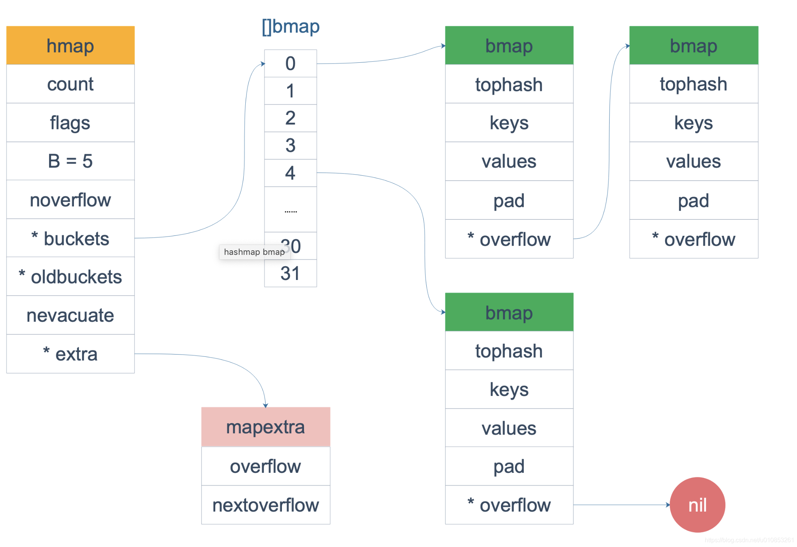  
bmap 是存放 k-v 的地方，bmap的存储分布如下：  
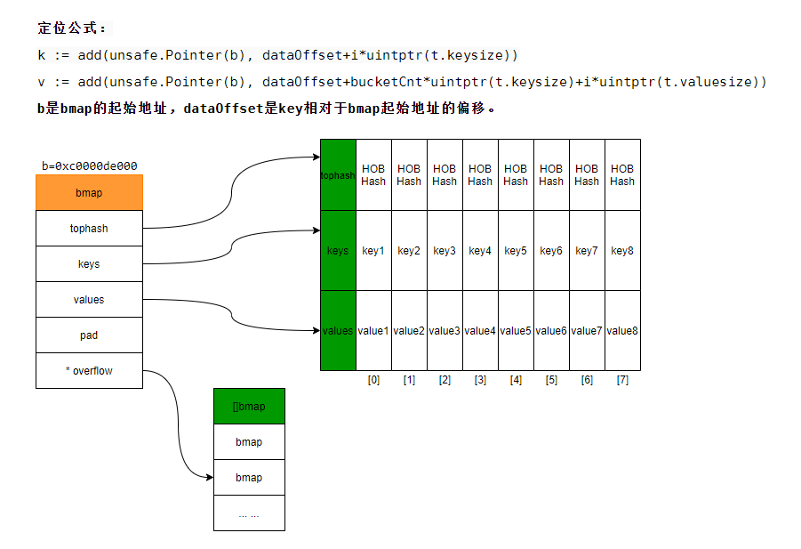  
这里可以看到bmap(bucket)的kv分布分开的，没有按照常规的kv/kv/kv…这种方式存储。源码里说这样的好处是在某些情况下可以省略掉 pad 字段，节省内存空间。  

每个 bucket 设计成最多只能放 8 个 key-value 对，如果有第 9 个 key-value 落入当前的 bucket，那就需要再构建一个 bucket ，通过 overflow 指针连接起来。  

### key定位与hash碰撞
对于map来说，如何通过key定位到实际的value，是性能与体验的关键指标。  

在golang的map中，key经过[hash](https://blog.csdn.net/Beyond_2016/article/details/81286360?ops_request_misc=%257B%2522request%255Fid%2522%253A%2522164723974516780269836868%2522%252C%2522scm%2522%253A%252220140713.130102334..%2522%257D&request_id=164723974516780269836868&biz_id=0&utm_medium=distribute.pc_search_result.none-task-blog-2~all~top_positive~default-1-81286360.first_rank_v2_pc_rank_v29&utm_term=hash&spm=1018.2226.3001.4187)计算后得到哈希值，哈希值是 64 个 bit 位（针对64位机）。**根据hash值的最后B个bit位来确定这个key落在哪个桶。** 如果 B = 5，那么桶的数量，也就是 buckets 数组的长度是 2^5 = 32。  

比如说，现在有一个key经过哈希函数计算后，得到如下的哈希结果：
```txt
  10010111 | 000011110110110010001111001010100010010110010101010 │ 01010
```
用最后的 5 个 bit 位，也就是 01010，值为 10，也就是 10 号桶。这个操作实际上就是取余操作，但是取余开销太大，所以代码实现上用的位操作代替。再用哈希值的高 8 位，找到此 key 在 bucket 中的位置，这是在寻找已有的 key。最开始桶内还没有 key，新加入的 key 会找到第一个空位放入。  

buckets 编号就是桶编号，当两个不同的 key 落在同一个桶中，也就是发生了哈希冲突。冲突的解决手段是用拉链法(链表法)：在 bucket 中，从前往后找到第一个空位。这样，在查找某个 key 时，先找到对应的桶，再去遍历 bucket 中的 key。  
检索原理如下：  
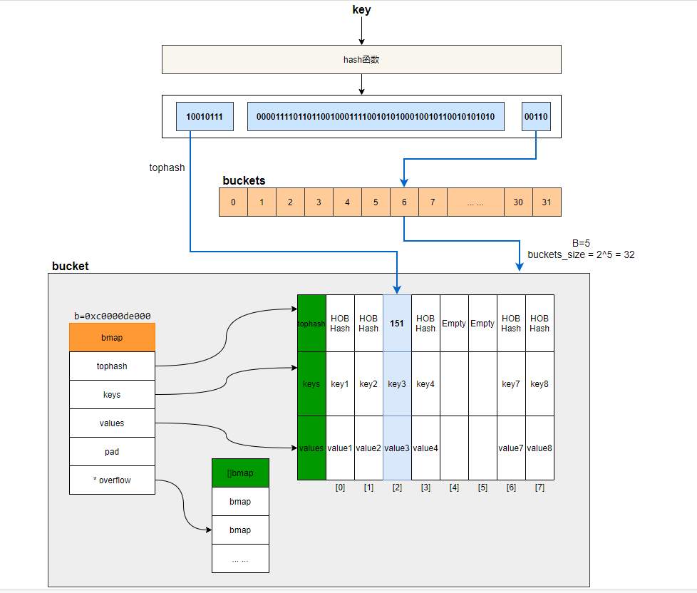  
上图中，假定 B = 5，所以 bucket 总数就是 2^5 = 32。首先计算出待查找 key 的哈希，使用低 5 位 00110，找到对应的 6 号 bucket，使用高 8 位 10010111，对应十进制 151，在 6 号 bucket 中 遍历bucket 寻找 tophash 值（HOB hash）为 151 的 key，找到了 2 号槽位，这样整个查找过程就结束了。  

如果在 bucket 中没找到，并且 overflow 不为空，还要继续去 overflow bucket 中寻找，直到找到或是所有的 key 槽位都找遍了，包括所有的 overflow bucket(这里需要遍历bucket数组中某个槽位的bucket链表的所有bucket)。  
_源码位于go/src/runtime/map.go中_  
```go
// mapaccess1 returns a pointer to h[key].  Never returns nil, instead
// it will return a reference to the zero object for the elem type if
// the key is not in the map.
func mapaccess1(t *maptype, h *hmap, key unsafe.Pointer) unsafe.Pointer {
  //......校验逻辑
  
  //如果 h 什么都没有，返回value类型的零值
  if h == nil || h.count == 0 {
    if t.hashMightPanic() {
      t.key.alg.hash(key, 0) // see issue 23734
    }
    return unsafe.Pointer(&zeroVal[0])
  }
  
  // 并发写冲突
  if h.flags&hashWriting != 0 {
    throw("concurrent map read and map write")
  }
  // 不同类型 key 使用的 hash 算法在编译期确定
  alg := t.key.alg
  hash := alg.hash(key, uintptr(h.hash0))
  
  // 求低 B 位的掩码.
  // 比如 B=5，那 m 就是31，低五位二进制是全1
  m := bucketMask(h.B)
  // b 就是 当前key对应的 bucket 的地址
  b := (*bmap)(add(h.buckets, (hash&m)*uintptr(t.bucketsize)))
  // oldbuckets 不为 nil，说明发生了扩容
  if c := h.oldbuckets; c != nil {
    if !h.sameSizeGrow() {
      // There used to be half as many buckets; mask down one more power of two.
      m >>= 1
    }
    // 求出 key 在老的 map 中的 bucket 位置
    oldb := (*bmap)(add(c, (hash&m)*uintptr(t.bucketsize)))
    // 如果 oldb 没有搬迁到新的 bucket
    // 那就在老的 bucket 中寻找
    if !evacuated(oldb) {
      b = oldb
    }
  }
  // 计算出高 8 位的 hash
  // 相当于右移 56 位，只取高8位
  top := tophash(hash)

// 这里进入bucket的二层循环找到对应的kv(第一层是bucket,第二层是bucket内部的8个slot)
bucketloop:
  // 遍历bucket以及overflow链表
  for ; b != nil; b = b.overflow(t) {
    //遍历bucket的8个slot
    for i := uintptr(0); i < bucketCnt; i++ {
      // tophash 不匹配
      if b.tophash[i] != top {
        // 标识当前bucket剩下的slot都是empty
        if b.tophash[i] == emptyRest {
          break bucketloop
        }
        continue
      }
      // 获取bucket的key
      k := add(unsafe.Pointer(b), dataOffset+i*uintptr(t.keysize))
      if t.indirectkey() {
        k = *((*unsafe.Pointer)(k))
      }
      if alg.equal(key, k) {
        //定位到 value 的位置
        e := add(unsafe.Pointer(b), dataOffset+bucketCnt*uintptr(t.keysize)+i*uintptr(t.elemsize))
        // value 解引用
        if t.indirectelem() {
          e = *((*unsafe.Pointer)(e))
        }
        return e
      }
    }
  }
  // overflow bucket 也找完了，说明没有目标 key
  // 返回零值
  return unsafe.Pointer(&zeroVal[0])
}
```
函数返回 h[key] 的指针，如果 h 中没有此 key，那就会返回一个 key 相应类型的零值，不会返回 nil。  

定位 key 和 value 的方法：  
```go
// key 定位公式
k := add(unsafe.Pointer(b), dataOffset+i*uintptr(t.keysize))

// value 定位公式
v := add(unsafe.Pointer(b), dataOffset+bucketCnt*uintptr(t.keysize)+i*uintptr(t.valuesize))
```
b 是 bmap 的地址，dataOffset 是 key 相对于 bmap 起始地址的偏移。  

因此 bucket 里 key 的起始地址就是 unsafe.Pointer(b)+dataOffset。第 i 个 key 的地址就要在此基础上跨过 i 个 key 的大小；而我们又知道，value 的地址是在所有 key 之后，因此第 i 个 value 的地址还需要加上所有 key 的偏移。  

当定位到一个具体的 bucket 时，里层循环就是遍历这个 bucket 里所有的 cell，或者说所有的槽位，也就是 bucketCnt=8 个槽位。  
整个循环过程：  
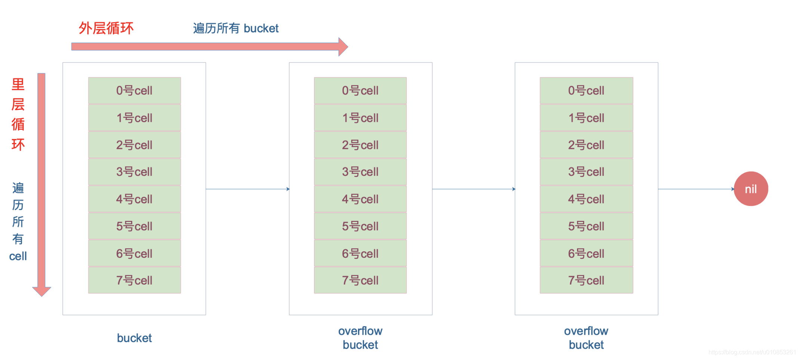  
再说一下 minTopHash，当一个 cell 的 tophash 值小于 minTopHash 时，标志这个 cell 的迁移状态。因为这个状态值是放在 tophash 数组里，为了和正常的哈希值区分开，会给 key 计算出来的哈希值一个增量：minTopHash。这样就能区分正常的 top hash 值和表示状态的哈希值。  

下面的这几种状态就表征了 bucket 的情况：  
```go
emptyRest      = 0 // this cell is empty, and there are no more non-empty cells at higher indexes or overflows.
emptyOne       = 1 // this cell is empty
// 扩容相关
evacuatedX     = 2 // key/elem is valid.  Entry has been evacuated to first half of larger table.
// 扩容相关
evacuatedY     = 3 // same as above, but evacuated to second half of larger table.
evacuatedEmpty = 4 // cell is empty, bucket is evacuated.
minTopHash     = 5 // minimum tophash for a normal filled cell.
```
源码里判断这个 bucket 是否已经搬迁完毕，用到的函数：  
```go
func evacuated(b *bmap) bool {
	h := b.tophash[0]
	return h > emptyOne && h < minTopHash
}
```
只取了 tophash 数组的第一个值，判断它是否在 1-5 之间。对比上面的常量，当 top hash 是 evacuatedEmpty、evacuatedX、evacuatedY 这三个值之一，说明此 bucket 中的 key 全部被搬迁到了新 bucket。  

## map扩容原理
使用 key 的 hash 值可以快速定位到目标 key，然而，随着向 map 中添加的 key 越来越多，key 发生碰撞的概率也越来越大。bucket 中的 8 个 cell 会被逐渐塞满，查找、插入、删除 key 的效率也会越来越低。最理想的情况是一个 bucket 只装一个 key，这样，就能达到 O(1) 的效率，但这样空间消耗太大，用空间换时间的代价太高。  

Go 语言采用一个 bucket 里装载 8 个 key，定位到某个 bucket 后，还需要再定位到具体的 key，这实际上又用了时间换空间。当然，这样做，要有一个度，不然所有的 key 都落在了同一个 bucket 里，直接退化成了链表，各种操作的效率直接降为 O(n)，是不行的。

因此，需要有一个指标来衡量前面描述的情况，这就是装载因子。  

Go 源码里这样定义装载因子：
```go
  loadFactor := count / (2^B) // count 就是 map 的元素个数，2^B 表示 bucket 数量。
```
再来说触发 map 扩容的条件，在向 map 插入新 key 的时候，会进行条件检测。  

符合下面这 2 个条件，就会触发扩容。  
1. 载因子超过阈值，源码里定义的阈值是 6.5。  
2. overflow 的 bucket 数量过多，这有两种情况：  
(1) 当 B 大于15时，也就是 bucket 总数大于 2^15 时，如果overflow的bucket数量大于2^15，就触发扩容。  
(2)当B小于15时，如果overflow的bucket数量大于2^B 也会触发扩容。  

通过汇编语言可以找到赋值操作对应源码中的函数是 mapassign，对应扩容条件的源码如下： 
源码位于go/src/runtime/map.go中  
```go
// 触发扩容时机
if !h.growing() && (overLoadFactor(h.count+1, h.B) || tooManyOverflowBuckets(h.noverflow, h.B)) {
  hashGrow(t, h)
  goto again // Growing the table invalidates everything, so try again
}

// overLoadFactor reports whether count items placed in 1<<B buckets is over loadFactor.
// 装载因子超过 6.5
func overLoadFactor(count int, B uint8) bool {
  return count > bucketCnt && uintptr(count) > loadFactorNum*(bucketShift(B)/loadFactorDen)
}

// tooManyOverflowBuckets reports whether noverflow buckets is too many for a map with 1<<B buckets.
// Note that most of these overflow buckets must be in sparse use;
// if use was dense, then we'd have already triggered regular map growth.
func tooManyOverflowBuckets(noverflow uint16, B uint8) bool {
  // If the threshold is too low, we do extraneous work.
  // If the threshold is too high, maps that grow and shrink can hold on to lots of unused memory.
  // "too many" means (approximately) as many overflow buckets as regular buckets.
  // See incrnoverflow for more details.
  if B > 15 {
    B = 15
  }
  // The compiler doesn't see here that B < 16; mask B to generate shorter shift code.
  // overflow buckets 太多
  return noverflow >= uint16(1)<<(B&15)
}
```
第 1 点：我们知道，每个 bucket 有 8 个空位，在没有溢出，且所有的桶都装满了的情况下，装载因子算出来的结果是 8。因此当装载因子超过 6.5 时，表明很多 bucket 都快要装满了，查找效率和插入效率都变低了。在这个时候进行扩容是有必要的。  

第 2 点：是对第 1 点的补充。就是说在装载因子比较小的情况下，这时候 map 的查找和插入效率也很低，而第 1 点识别不出来这种情况。表面现象就是计算装载因子的分子比较小，即 map 里元素总数少，但是 bucket 数量多（真实分配的 bucket 数量多，包括大量的 overflow bucket）。  

不难想像造成这种情况的原因：不停地插入、删除元素。先插入很多元素，导致创建了很多 bucket，但是装载因子达不到第 1 点的临界值，未触发扩容来缓解这种情况。之后，删除元素降低元素总数量，再插入很多元素，导致创建很多的 overflow bucket，但就是不会触犯第 1 点的规定，你能拿我怎么办？**overflow bucket 数量太多，导致 key 会很分散，查找插入效率低得吓人，** 因此出台第 2 点规定。这就像是一座空城，房子很多，但是住户很少，都分散了，找起人来很困难。  

对于命中条件 1，2 的限制，都会发生扩容。  

但是扩容的策略并不相同，毕竟两种条件应对的场景不同。  

对于条件 1，元素太多，而 bucket 数量太少，很简单：将 B 加 1，bucket 最大数量 (2^B) 直接变成原来 bucket 数量的 2 倍。于是，就有新老 bucket 了。注意，这时候元素都在老 bucket 里，还没迁移到新的 bucket 来。而且，新 bucket 只是最大数量变为原来最大数量（2^B）的 2 倍（2^B * 2）。  

对于条件 2，其实元素没那么多，但是 overflow bucket 数特别多，说明很多 bucket 都没装满。解决办法就是开辟一个新 bucket 空间，将老 bucket 中的元素移动到新 bucket，使得同一个 bucket 中的 key 排列地更紧密。这样，原来，在 overflow bucket 中的 key 可以移动到 bucket 中来。结果是节省空间，提高 bucket 利用率，map 的查找和插入效率自然就会提升。  

对于条件 2 的解决方案，有一个极端的情况：如果插入 map 的 key 哈希都一样，就会落到同一个 bucket 里，超过 8 个就会产生 overflow bucket，结果也会造成 overflow bucket 数过多。移动元素其实解决不了问题，因为这时整个哈希表已经退化成了一个链表，操作效率变成了 O(n)。  

前面说了扩容的条件，下面看一下扩容到底是怎么做的：由于 map 扩容需要将原有的 key/value 重新搬迁到新的内存地址，如果有大量的 key/value 需要搬迁，在搬迁过程中map会阻塞，非常影响性能。因此 Go map 的扩容采取了一种称为 “渐进式” 的方式，原有的 key 并不会一次性搬迁完毕，每次最多只会搬迁 2 个bucket。  

上面说的 hashGrow() 函数实际上并没有真正地“搬迁”，它只是分配好了新的 buckets，并将老的 buckets 挂到了新的map的 oldbuckets 字段上。真正搬迁 buckets 的动作在 growWork() 函数中，而调用 growWork() 函数的动作是在 mapassign 和 mapdelete 函数中。也就是插入或修改、删除 key 的时候，都会尝试进行搬迁 buckets 的工作。先检查 oldbuckets 是否搬迁完毕，具体来说就是检查 oldbuckets 是否为 nil。  

先看 hashGrow() 函数所做的工作，再来看具体的搬迁 buckets 是如何进行的。  
```go
func hashGrow(t *maptype, h *hmap) {
  // B+1 相当于是原来 2 倍的空间
  bigger := uint8(1)
  
  // 对应于等容扩容
  if !overLoadFactor(h.count+1, h.B) {
    // 进行等量的内存扩容，所以 B 不变
    bigger = 0
    h.flags |= sameSizeGrow
  }
  oldbuckets := h.buckets
  // 申请新的 buckets 空间
  newbuckets, nextOverflow := makeBucketArray(t, h.B+bigger, nil)

  flags := h.flags &^ (iterator | oldIterator)
  if h.flags&iterator != 0 {
    flags |= oldIterator
  }
  // commit the grow (atomic wrt gc)
  h.B += bigger
  h.flags = flags
  h.oldbuckets = oldbuckets
  h.buckets = newbuckets
  // 当前搬迁进度为0
  h.nevacuate = 0
  h.noverflow = 0

  //......
}
```
主要是申请到了新的 buckets 空间，把相关的标志位都进行了处理：例如标志 nevacuate 被置为 0， 表示当前搬迁进度为 0。  

需要特别提一下的是h.flags的操作：  
```go
flags := h.flags &^ (iterator | oldIterator)
if h.flags&iterator != 0 {
  flags |= oldIterator
}
```
这里得先说下运算符：&^。这叫按位置 0运算符。例如：  
```go
x = 01010011
y = 01010100
z = x &^ y = 00000011
```
如果 y bit 位为 1，那么结果 z 对应 bit 位就为 0，否则 z 对应 bit 位就和 x 对应 bit 位的值相同。  

所以上面那段对 flags 一顿操作的代码的意思是：先把 h.flags 中 iterator 和 oldIterator 对应位清 0，然后如果发现 iterator 位为 1，那就把它转接到 oldIterator 位，使得 oldIterator 标志位变成 1。潜台词就是：buckets 现在挂到了 oldBuckets 名下了，对应的标志位也转接过去。  

几个标志位如下：
```go
// 可能有迭代器使用 buckets
iterator     = 1
// 可能有迭代器使用 oldbuckets
oldIterator  = 2
// 有协程正在并发的向 map 中写入 key
hashWriting  = 4
// 等量扩容（对应条件 2）
sameSizeGrow = 8
```
再来看看真正执行搬迁工作的 growWork() 函数。  
```go
func growWork(t *maptype, h *hmap, bucket uintptr) {
  // 确认搬迁老的 bucket 对应正在使用的 bucket
  evacuate(t, h, bucket&h.oldbucketmask())

  // 再搬迁一个 bucket，以加快搬迁进程
  if h.growing() {
    evacuate(t, h, h.nevacuate)
  }
}
```
h.growing() 函数非常简单：  
```go
func (h *hmap) growing() bool {
  return h.oldbuckets != nil
}
```
如果 oldbuckets 不为空，说明还没有搬迁完毕，还得继续搬。  

bucket&h.oldbucketmask() 这行代码，如源码注释里说的，是为了确认搬迁的 bucket 是我们正在使用的 bucket。oldbucketmask() 函数返回扩容前的 map 的 bucketmask。  

所谓的 bucketmask，作用就是将 key 计算出来的哈希值与 bucketmask 相&，得到的结果就是 key 应该落入的桶。比如 B = 5，那么 bucketmask 的低 5 位是 11111，其余位是 0，hash 值与其相与的意思是，只有 hash 值的低 5 位决策 key 到底落入哪个 bucket。  

接下来，重点放在搬迁的关键函数 evacuate。源码如下：  
```go
// oldbucket是
func evacuate(t *maptype, h *hmap, oldbucket uintptr) {
  //  获取old bucket 的地址
  b := (*bmap)(add(h.oldbuckets, oldbucket*uintptr(t.bucketsize)))
  newbit := h.noldbuckets()
  if !evacuated(b) {
    // TODO: reuse overflow buckets instead of using new ones, if there
    // is no iterator using the old buckets.  (If !oldIterator.)

    // xy contains the x and y (low and high) evacuation destinations.
    // X和Y分别代表，如果是2倍扩容时，对应的前半部分和后半部分
    var xy [2]evacDst
    x := &xy[0]
    // 默认是等 size 扩容，前后 bucket 序号不变
    x.b = (*bmap)(add(h.buckets, oldbucket*uintptr(t.bucketsize)))
    x.k = add(unsafe.Pointer(x.b), dataOffset)
    x.e = add(x.k, bucketCnt*uintptr(t.keysize))
    
    if !h.sameSizeGrow() {
      // Only calculate y pointers if we're growing bigger.
      // Otherwise GC can see bad pointers.
      // 如果不是等 size 扩容，前后 bucket 序号有变
      // 使用 y 来进行搬迁
      y := &xy[1]
      y.b = (*bmap)(add(h.buckets, (oldbucket+newbit)*uintptr(t.bucketsize)))
      y.k = add(unsafe.Pointer(y.b), dataOffset)
      y.e = add(y.k, bucketCnt*uintptr(t.keysize))
    }
    // 遍历所有的 bucket，包括 overflow buckets
    // b 是老的 bucket 地址
    for ; b != nil; b = b.overflow(t) {
      k := add(unsafe.Pointer(b), dataOffset)
      e := add(k, bucketCnt*uintptr(t.keysize))
      for i := 0; i < bucketCnt; i, k, e = i+1, add(k, uintptr(t.keysize)), add(e, uintptr(t.elemsize)) {
        // 当前 cell 的 top hash 值
        top := b.tophash[i]
        // 如果 cell 为空，即没有 key
        if isEmpty(top) {
          b.tophash[i] = evacuatedEmpty
          continue
        }
        // 正常不会出现这种情况
        // 未被搬迁的 cell 只可能是 empty 或是
        // 正常的 top hash（大于 minTopHash）
        if top < minTopHash {
          throw("bad map state")
        }
        k2 := k
        if t.indirectkey() {
          k2 = *((*unsafe.Pointer)(k2))
        }
        var useY uint8
        // 如果不是等量扩容，说明要移动到Y part
        if !h.sameSizeGrow() {
          // Compute hash to make our evacuation decision (whether we need
          // to send this key/elem to bucket x or bucket y).
          hash := t.key.alg.hash(k2, uintptr(h.hash0))
          // // 如果有协程正在遍历 map 且出现 相同的 key 值，算出来的 hash 值不同
          if h.flags&iterator != 0 && !t.reflexivekey() && !t.key.alg.equal(k2, k2) {
            // If key != key (NaNs), then the hash could be (and probably
            // will be) entirely different from the old hash. Moreover,
            // it isn't reproducible. Reproducibility is required in the
            // presence of iterators, as our evacuation decision must
            // match whatever decision the iterator made.
            // Fortunately, we have the freedom to send these keys either
            // way. Also, tophash is meaningless for these kinds of keys.
            // We let the low bit of tophash drive the evacuation decision.
            // We recompute a new random tophash for the next level so
            // these keys will get evenly distributed across all buckets
            // after multiple grows.
            useY = top & 1
            top = tophash(hash)
          } else {
            if hash&newbit != 0 {
              useY = 1
            }
          }
        }

        if evacuatedX+1 != evacuatedY || evacuatedX^1 != evacuatedY {
          throw("bad evacuatedN")
        }

        b.tophash[i] = evacuatedX + useY // evacuatedX + 1 == evacuatedY
        // 找到实际的目的bucket.
        dst := &xy[useY]                 // evacuation destination

        if dst.i == bucketCnt {
          dst.b = h.newoverflow(t, dst.b)
          dst.i = 0
          dst.k = add(unsafe.Pointer(dst.b), dataOffset)
          dst.e = add(dst.k, bucketCnt*uintptr(t.keysize))
        }
        dst.b.tophash[dst.i&(bucketCnt-1)] = top // mask dst.i as an optimization, to avoid a bounds check
        // 执行实际的复制操作.
        if t.indirectkey() {
          *(*unsafe.Pointer)(dst.k) = k2 // copy pointer
        } else {
          typedmemmove(t.key, dst.k, k) // copy elem
        }
        if t.indirectelem() {
          *(*unsafe.Pointer)(dst.e) = *(*unsafe.Pointer)(e)
        } else {
          typedmemmove(t.elem, dst.e, e)
        }
        // 定位到下一个 cell
        dst.i++
        // These updates might push these pointers past the end of the
        // key or elem arrays.  That's ok, as we have the overflow pointer
        // at the end of the bucket to protect against pointing past the
        // end of the bucket.
        dst.k = add(dst.k, uintptr(t.keysize))
        dst.e = add(dst.e, uintptr(t.elemsize))
      }
    }
    // 如果没有协程在使用老的 buckets，就把老 buckets 清除掉，帮助gc
    if h.flags&oldIterator == 0 && t.bucket.ptrdata != 0 {
      b := add(h.oldbuckets, oldbucket*uintptr(t.bucketsize))
      // Preserve b.tophash because the evacuation
      // state is maintained there.
      ptr := add(b, dataOffset)
      n := uintptr(t.bucketsize) - dataOffset
      memclrHasPointers(ptr, n)
    }
  }

  if oldbucket == h.nevacuate {
    advanceEvacuationMark(h, t, newbit)
  }
}
```

搬迁的目的就是将老的 buckets 搬迁到新的 buckets。而通过前面的说明我们知道，应对条件 1，新的 buckets 数量是之前的一倍，应对条件 2，新的 buckets 数量和之前相等。  

对于条件 1，从老的 buckets 搬迁到新的 buckets，由于 bucktes 数量不变，因此可以按序号来搬，比如原来在 0 号 bucktes，到新的地方后，仍然放在 0 号 buckets。  

对于条件 2，就没这么简单了。要重新计算 key 的哈希，才能决定它到底落在哪个 bucket。例如，原来 B = 5，计算出 key 的哈希后，只用看它的低 5 位，就能决定它落在哪个 bucket。扩容后，B 变成了 6，因此需要多看一位，它的低 6 位决定 key 落在哪个 bucket。这称为 rehash。  

因此，某个 key 在搬迁前后 bucket 序号可能和原来相等，也可能是相比原来加上 2^B（原来的 B 值），取决于 hash 值 第 6 bit 位是 0 还是 1。  

理解了上面 bucket 序号的变化，我们就可以回答另一个问题了：**为什么遍历 map 是无序的？**  

map 在扩容后，会发生 key 的搬迁，原来落在同一个 bucket 中的 key，搬迁后，有些 key 就要远走高飞了（bucket 序号加上了 2^B）。而遍历的过程，就是按顺序遍历 bucket，同时按顺序遍历 bucket 中的 key。搬迁后，key 的位置发生了重大的变化，有些 key 飞上高枝，有些 key 则原地不动。这样，遍历 map 的结果就不可能按原来的顺序了。  

当然，如果我就一个 hard code 的 map，我也不会向 map 进行插入删除的操作，按理说每次遍历这样的 map 都会返回一个固定顺序的 key/value 序列吧。的确是这样，但是 Go 杜绝了这种做法，因为这样会给新手程序员带来误解，以为这是一定会发生的事情，在某些情况下，可能会酿成大错。  

当然，Go 做得更绝，当我们在遍历 map 时，并不是固定地从 0 号 bucket 开始遍历，每次都是从一个随机值序号的 bucket 开始遍历，并且是从这个 bucket 的一个随机序号的 cell 开始遍历。这样，即使你是一个写死的 map，仅仅只是遍历它，也不太可能会返回一个固定序列的 key/value 对了。  

再明确一个问题：**如果扩容后，B 增加了 1，意味着 buckets 总数是原来的 2 倍，原来 1 号的桶“裂变”到两个桶。**  

例如，原始 B = 2，1号 bucket 中有 2 个 key 的哈希值低 3 位分别为：010，110。由于原来 B = 2，所以低 2 位 10 决定它们落在 2 号桶，现在 B 变成 3，所以 010、110 分别落入 2、6 号桶。  
  

再来讲搬迁函数中的几个关键点：  

evacuate 函数每次只完成一个 bucket 的搬迁工作，因此要遍历完此 bucket 的所有的 cell，将有值的 cell copy 到新的地方。bucket 还会链接 overflow bucket，它们同样需要搬迁。因此会有 2 层循环，外层遍历 bucket 和 overflow bucket，内层遍历 bucket 的所有 cell。这样的循环在 map 的源码里到处都是，要理解透了。  

源码里提到 X, Y part，其实就是我们说的如果是扩容到原来的 2 倍，桶的数量是原来的 2 倍，前一半桶被称为 X part，后一半桶被称为 Y part。一个 bucket 中的 key 可能会分裂落到 2 个桶，一个位于 X part，一个位于 Y part。所以在搬迁一个 cell 之前，需要知道这个 cell 中的 key 是落到哪个 Part。很简单，重新计算 cell 中 key 的 hash，并向前“多看”一位，决定落入哪个 Part，这个前面也说得很详细了。  

有一个特殊情况是：有一种 key，每次对它计算 hash，得到的结果都不一样。这个 key 就是 math.NaN() 的结果，它的含义是 not a number，类型是 float64。当它作为 map 的 key，在搬迁的时候，会遇到一个问题：再次计算它的哈希值和它当初插入 map 时的计算出来的哈希值不一样！  

你可能想到了，这样带来的一个后果是，这个 key 是永远不会被 Get 操作获取的！当我使用 m[math.NaN()] 语句的时候，是查不出来结果的。这个 key 只有在遍历整个 map 的时候，才有机会现身。所以，可以向一个 map 插入任意数量的 math.NaN() 作为 key。  

当搬迁碰到 math.NaN() 的 key 时，只通过 tophash 的最低位决定分配到 X part 还是 Y part（如果扩容后是原来 buckets 数量的 2 倍）。如果 tophash 的最低位是 0 ，分配到 X part；如果是 1 ，则分配到 Y part。  

确定了要搬迁到的目标 bucket 后，搬迁操作就比较好进行了。将源 key/value 值 copy 到目的地相应的位置。

设置 key 在原始 buckets 的 tophash 为 evacuatedX 或是 evacuatedY，表示已经搬迁到了新 map 的 x part 或是 y part。新 map 的 tophash 则正常取 key 哈希值的高 8 位。  

下面通过图来宏观地看一下扩容前后的变化。
*扩容前，B = 2，共有 4 个 buckets，lowbits 表示 hash 值的低位。假设我们不关注其他 buckets 情况，专注在 2 号 bucket。并且假设 overflow 太多，触发了等量扩容（对应于前面的条件 2）。*  
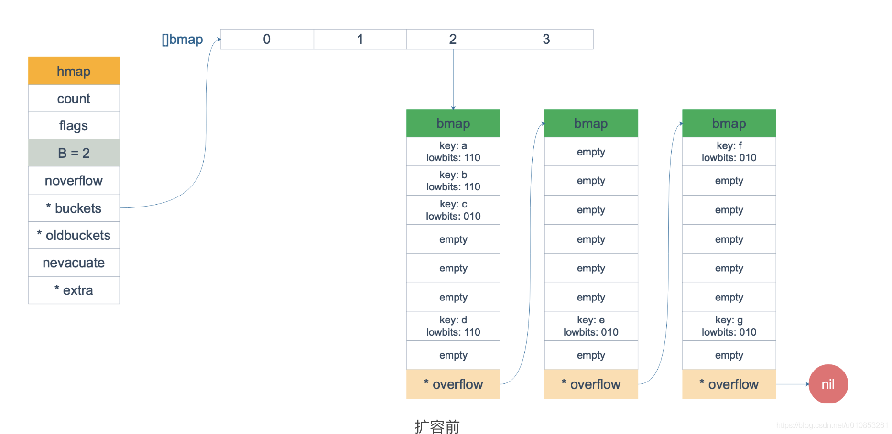  
扩容完成后，overflow bucket 消失了，key 都集中到了一个 bucket，更为紧凑了，提高了查找的效率。  
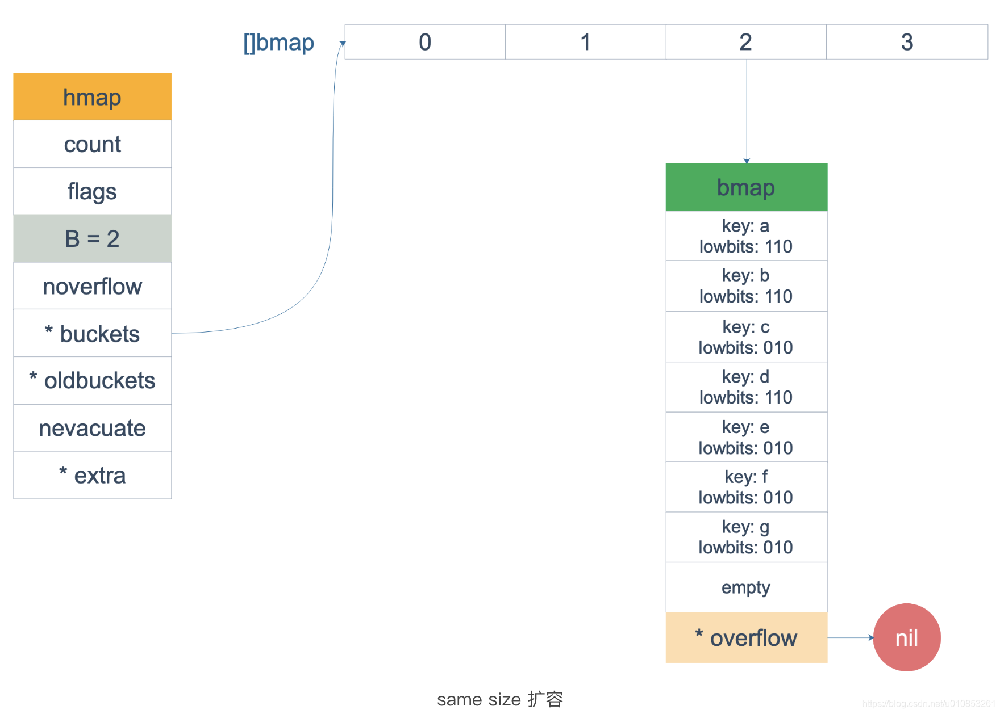  
假设触发了 2 倍的扩容，那么扩容完成后，老 buckets 中的 key 分裂到了 2 个 新的 bucket。一个在 x part，一个在 y 的 part。依据是 hash 的 lowbits。新 map 中 0-3 称为 x part，4-7 称为 y part。 
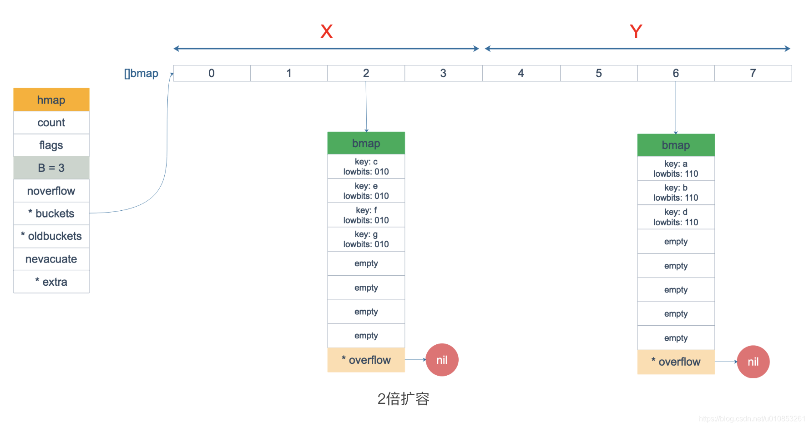  
注意，上面的两张图忽略了其他 buckets 的搬迁情况，表示所有的 bucket 都搬迁完毕后的情形。实际上，我们知道，搬迁是一个“渐进”的过程，并不会一下子就全部搬迁完毕。所以在搬迁过程中，oldbuckets 指针还会指向原来老的 []bmap，并且已经搬迁完毕的 key 的 tophash 值会是一个状态值，表示 key 的搬迁去向。  

## map访问与迭代
### 访问
map 中插入或者修改 key，最终调用的是 mapassign 函数(实际上插入或修改 key 的语法是一样的，只不过前者操作的 key 在 map 中不存在，而后者操作的 key 存在 map 中)。  

mapassign 函数是访问元素的关键，mapassign 有一个系列的函数，根据 key 类型的不同，编译器会将其优化为相应的“快速函数”。  
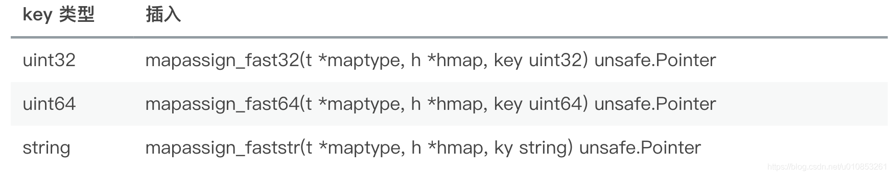  
整体来看，流程非常得简单：对 key 计算 hash 值，根据 hash 值按照之前的流程，找到要赋值的位置（可能是插入新 key，也可能是更新老 key），对相应位置进行赋值。  

函数首先会检查 map 的标志位 flags。如果 flags 的写标志位此时被置 1 了，说明有其他协程在执行“写”操作，进而导致程序 panic。这也说明了 map 对协程是不安全的。  

在正式安置 key 之前，还要检查 map 的状态，看它是否需要进行扩容。如果满足扩容的条件，就主动触发一次扩容操作。  

最后，会更新 map 相关的值，如果是插入新 key，map 的元素数量字段 count 值会加 1；在函数之初设置的 hashWriting 写标志出会清零。  

函数的原型并没有传入 value 值，所以赋值操作是什么时候执行的呢？mapassign 函数返回的指针就是指向的 key 所对应的 value 值位置，有了地址，就很好操作赋值了。  

### 迭代
本来 map 的遍历过程比较简单：遍历所有的 bucket 以及它后面挂的 overflow bucket，然后挨个遍历 bucket 中的所有 cell。每个 bucket 中包含 8 个 cell，从有 key 的 cell 中取出 key 和 value，这个过程就完成了。  

但是，现实并没有这么简单。还记得前面讲过的扩容过程吗？扩容过程不是一个原子的操作，它每次最多只搬运 2 个 bucket，所以如果触发了扩容操作，那么在很长时间里，map 的状态都是处于一个中间态：有些 bucket 已经搬迁到新家，而有些 bucket 还待在老地方。  

因此，遍历如果发生在扩容的过程中，就会涉及到遍历新老 bucket 的过程，这是难点所在。 

一个简单的代码样例，假装不知道遍历过程具体调用的是什么函数：  
```go
package main

import "fmt"

func main() {
  ageMp := make(map[string]int)
  ageMp["qcrao"] = 18

  for name, age := range ageMp {
    fmt.Println(name, age)
  }
}
```
执行命令：  
```go
go tool compile -S main.go
```
得到关键的几行汇编代码如下：
```go
// ......
0x0124 00292 (test16.go:9)      CALL    runtime.mapiterinit(SB)

// ......
0x01fb 00507 (test16.go:9)      CALL    runtime.mapiternext(SB)
0x0200 00512 (test16.go:9)      MOVQ    ""..autotmp_4+160(SP), AX
0x0208 00520 (test16.go:9)      TESTQ   AX, AX
0x020b 00523 (test16.go:9)      JNE     302

// ......
```
关于 map 迭代，底层的函数调用关系是调用 mapiterinit 函数初始化迭代器，然后循环调用 mapiternext 函数进行 map 迭代。  

迭代器的结构体定义：
```go
type hiter struct {
  key         unsafe.Pointer // Must be in first position.  Write nil to indicate iteration end (see cmd/internal/gc/range.go).
  elem        unsafe.Pointer // Must be in second position (see cmd/internal/gc/range.go).
  t           *maptype
  h           *hmap
  buckets     unsafe.Pointer // bucket ptr at hash_iter initialization time
  bptr        *bmap          // current bucket
  overflow    *[]*bmap       // keeps overflow buckets of hmap.buckets alive
  oldoverflow *[]*bmap       // keeps overflow buckets of hmap.oldbuckets alive
  startBucket uintptr        // bucket iteration started at
  offset      uint8          // intra-bucket offset to start from during iteration (should be big enough to hold bucketCnt-1)
  wrapped     bool           // already wrapped around from end of bucket array to beginning
  B           uint8
  i           uint8
  bucket      uintptr
  checkBucket uintptr
}
```
mapiterinit 就是对 hiter 结构体里的字段进行初始化赋值操作。  

前面已经提到过，即使是对一个写死的 map 进行遍历，每次出来的结果也是无序的。  
下面我们就可以近距离地观察他们的实现:  
```go
// 生成随机数 r
r := uintptr(fastrand())
if h.B > 31-bucketCntBits {
  r += uintptr(fastrand()) << 31
}
// 从哪个 bucket 开始遍历
it.startBucket = r & bucketMask(h.B)
it.offset = uint8(r >> h.B & (bucketCnt - 1))
```
例如，B = 2，那 uintptr(1) << h.B - 1 结果就是 3，低 8 位为 0000 0011，将 r 与之 & ，就可以得到一个0-3 的 bucket 序号；bucketCnt - 1 等于 7，低 8 位为 0000 0111，将 r 右移 2 位后，与 7 相与，就可以得到一个 0~7 号的 cell。  

于是，在 mapiternext 函数中就会从 it.startBucket 的 it.offset 号的 cell 开始遍历，取出其中的 key 和 value，直到又回到起点 bucket，完成遍历过程。  

假设我们有下图所示的一个 map，起始时 B = 1，有两个 bucket，后来触发了扩容（这里不要深究扩容条件，只是一个设定），B 变成 2。并且， 1 号 bucket 中的内容搬迁到了新的 bucket，1 号裂变成 1 号和 3 号；0 号 bucket 暂未搬迁。老的 bucket 挂在在 *oldbuckets 指针上面，新的 bucket 则挂在 *buckets 指针上面。  
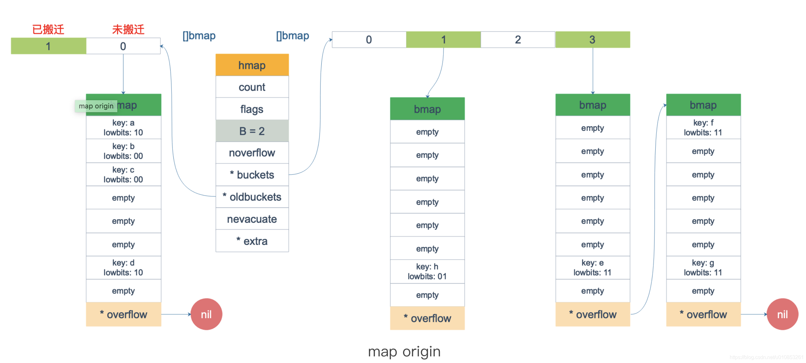  
这时，我们对此 map 进行遍历。假设经过初始化后，startBucket = 3，offset = 2。于是，遍历的起点将是 3 号 bucket 的 2 号 cell。  
下面这张图就是开始遍历时的状态：  
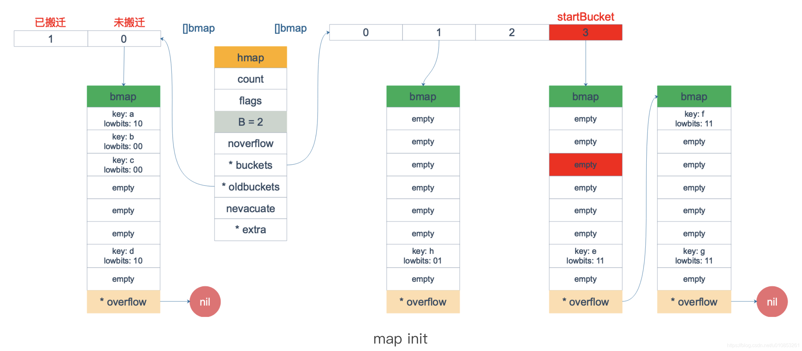  
标红的表示起始位置，bucket 遍历顺序为：3 -> 0 -> 1 -> 2。  
因为 3 号 bucket 对应老的 1 号 bucket，因此先检查老 1 号 bucket 是否已经被搬迁过。  
判断方法就是：  
```go
func evacuated(b *bmap) bool {
  h := b.tophash[0]
  return h > emptyOne && h < minTopHash
}
```
如果 b.tophash[0] 的值在标志值范围内，即在 (1,5) 区间里，说明已经被搬迁过了。  
```go
emptyRest      = 0 // this cell is empty, and there are no more non-empty cells at higher indexes or overflows.
emptyOne       = 1 // this cell is empty
evacuatedX     = 2 // key/elem is valid.  Entry has been evacuated to first half of larger table.
evacuatedY     = 3 // same as above, but evacuated to second half of larger table.
evacuatedEmpty = 4 // cell is empty, bucket is evacuated.
minTopHash     = 5 // minimum tophash for a normal filled cell.
```
在本例中，老 1 号 bucket 已经被搬迁过了。所以它的 tophash[0] 值在 (1,5) 范围内，因此只用遍历新的 3 号 bucket。  
依次遍历 3 号 bucket 的 cell，这时候会找到第一个非空的 key：元素 e。到这里，mapiternext 函数返回，这时我们的遍历结果仅有一个元素：  
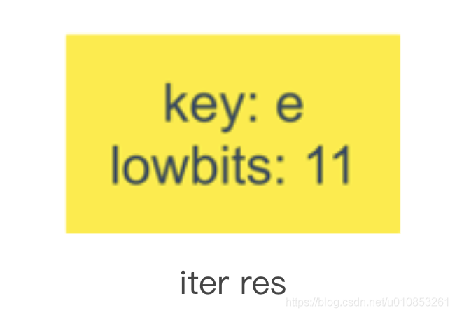  
由于返回的 key 不为空，所以会继续调用 mapiternext 函数。  

继续从上次遍历到的地方往后遍历，从新 3 号 overflow bucket 中找到了元素 f 和 元素 g。  

遍历结果集也因此壮大：  
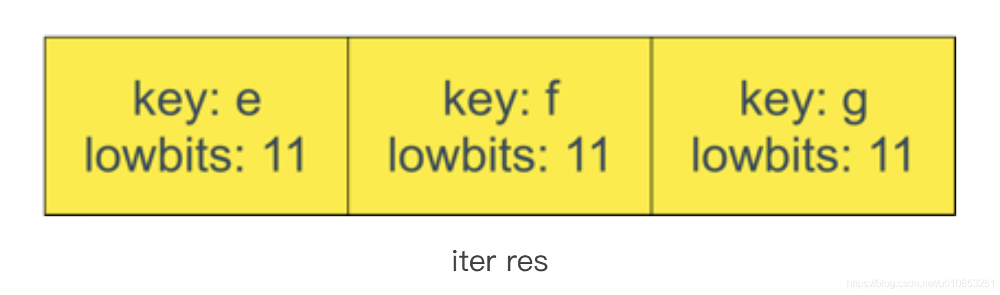 
新 3 号 bucket 遍历完之后，回到了新 0 号 bucket。0 号 bucket 对应老的 0 号 bucket，经检查，老 0 号 bucket 并未搬迁，因此对新 0 号 bucket 的遍历就改为遍历老 0 号 bucket。那是不是把老 0 号 bucket 中的所有 key 都取出来呢？  

并没有这么简单，回忆一下，老 0 号 bucket 在搬迁后将裂变成 2 个 bucket：新 0 号、新 2 号。而我们此时正在遍历的只是新 0 号 bucket（注意，遍历都是遍历的 *bucket 指针，也就是所谓的新 buckets）。所以，我们只会取出老 0 号 bucket 中那些在裂变之后，分配到新 0 号 bucket 中的那些 key。  

因此，lowbits == 00 的将进入遍历结果集：  
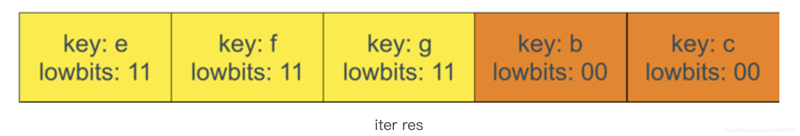  
和之前的流程一样，继续遍历新 1 号 bucket，发现老 1 号 bucket 已经搬迁，只用遍历新 1 号 bucket 中现有的元素就可以了。结果集变成：  
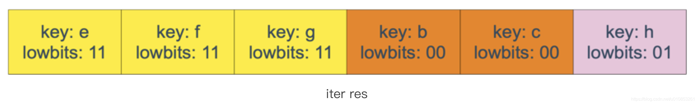  
继续遍历新 2 号 bucket，它来自老 0 号 bucket，因此需要在老 0 号 bucket 中那些会裂变到新 2 号 bucket 中的 key，也就是 lowbit == 10 的那些 key。  

这样，遍历结果集变成：  
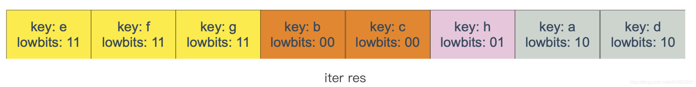  
最后，继续遍历到新 3 号 bucket 时，发现所有的 bucket 都已经遍历完毕，整个迭代过程执行完毕。  

顺便说一下，如果碰到 key 是 math.NaN() 这种的，处理方式类似。核心还是要看它被分裂后具体落入哪个 bucket。只不过只用看它 top hash 的最低位。如果 top hash 的最低位是 0 ，分配到 X part；如果是 1 ，则分配到 Y part。据此决定是否取出 key，放到遍历结果集里。  

map 遍历的核心在于理解 2 倍扩容时，老 bucket 会分裂到 2 个新 bucket 中去。而遍历操作，会按照新 bucket 的序号顺序进行，碰到老 bucket 未搬迁的情况时，要在老 bucket 中找到将来要搬迁到新 bucket 来的 key。  

## map常见面试点  
+ **[map的实现原理](https://zhang-jie-jun.github.io/blog/src/golang/map.html)**  
+ **[详细说一下拉链法(链地址法)](https://blog.csdn.net/lcalqf/article/details/60775221)**
+ **map是协程安全的吗？**  
map 并不是一个线程安全的数据结构。同时读写一个 map 是未定义的行为，如果被检测到，会直接 panic。  
一般而言，这可以通过读写锁来解决：sync.RWMutex。  
读之前调用 RLock() 函数，读完之后调用 RUnlock() 函数解锁；写之前调用 Lock() 函数，写完之后，调用 Unlock() 解锁。  
另外，sync.Map 是线程安全的 map，可以使用。 
+ **map遍历是有序的吗？为什么？**  
map 在扩容后，会发生 key 的搬迁，原来落在同一个 bucket 中的 key，搬迁后，有些 key 就要远走高飞了（bucket 序号加上了 2^B）。而遍历的过程，就是按顺序遍历 bucket，同时按顺序遍历 bucket 中的 key。搬迁后，key 的位置发生了重大的变化，有些 key 飞上高枝，有些 key 则原地不动。这样，遍历 map 的结果就不可能按原来的顺序了。  
当然，Go 做得更绝，当我们在遍历 map 时，并不是固定地从 0 号 bucket 开始遍历，每次都是从一个随机值序号的 bucket 开始遍历，并且是从这个 bucket 的一个随机序号的 cell 开始遍历。这样，即使你是一个写死的 map，仅仅只是遍历它，也不太可能会返回一个固定序列的 key/value 对了。  
+ **可以边遍历边删除吗？**   
不可以，map 并不是一个线程安全的数据结构。
+ **key 可以是 float 型吗？**  
从语法上看，是可以的。Go 语言中只要是可比较的类型都可以作为 key。除开 slice，map，functions 这几种类型，其他类型都是 OK 的。具体包括：布尔值、数字、字符串、指针、通道、接口类型、结构体、只包含上述类型的数组。这些类型的共同特征是支持== 和 != 操作符，k1 == k2 时，可认为 k1 和 k2 是同一个 key。如果是结构体，则需要它们的字段值都相等，才被认为是相同的 key。  
顺便说一句，任何类型都可以作为 value，包括 map 类型。  
最后说结论：float 型可以作为 key，但是由于精度的问题，会导致一些诡异的问题，慎用之。  

## 参考资料
[Golang map实践以及实现原理](https://blog.csdn.net/u010853261/article/details/99699350)  
[由浅到深，入门Go语言Map实现原理](https://blog.csdn.net/github_38773259/article/details/111503483)  
[Golang map底层实现原理解析](https://blog.csdn.net/luolianxi/article/details/105371079)  
[浅析Golang map的实现原理](https://www.cnblogs.com/freeweb/p/15898542.html)  


<center>...未完待续...</center>  
---  
***  

<link rel="stylesheet" href="https://cdn.jsdelivr.net/npm/gitalk@1/dist/gitalk.css">
<script src="https://cdn.jsdelivr.net/npm/gitalk@1/dist/gitalk.min.js"></script>
<div id="gitalk-container"></div>
<script>
  var gitalk = new Gitalk({
    "clientID": "44d7c96f948be236a8c9",
    "clientSecret": "fb9fb3178db6640131c4e3eb69f9449e42bba661",
    "repo": "blog",
    "owner": "Zhang-jie-jun",
    "admin": ["Zhang-jie-jun"],
    "id": location.pathname,      
    "distractionFreeMode": false  
  });
  gitalk.render("gitalk-container");
</script>
