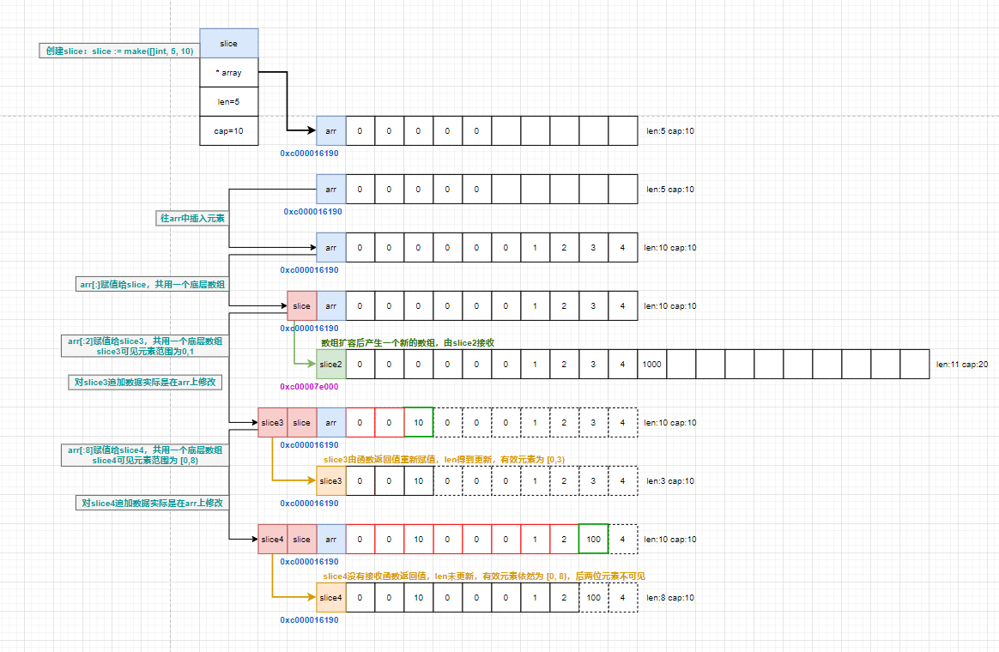

# slice底层原理

## slice是什么？
切片(slice)是 Golang 中一种比较特殊的数据结构，这种数据结构更便于使用和管理数据集合。切片是围绕动态数组的概念构建的，可以按需自动增长和缩小。切片(slice)是可以看做是一个长度可变的数组。  
切片(slice)自身并不是动态数组或者数组指针。它内部实现的数据结构通过指针引用底层数组，设定相关属性将数据读写操作限定在指定的区域内。  
切片(slice)是对数组一个连续片段的引用，所以切片是一个引用类型。  

## slice的数据结构
&emsp;&emsp;切片本身并不是动态数组或者数组指针。它内部实现的数据结构通过指针引用底层数组，设定相关属性将数据读写操作限定在指定的区域内。**切片本身是一个只读对象，其工作机制类似数组指针的一种封装**。  

&emsp;&emsp;切片（slice）是对数组一个连续片段的引用，所以切片是一个引用类型（因此更类似于 C/C++ 中的数组类型，或者 Python 中的 list 类型）。这个片段可以是整个数组，或者是由起始和终止索引标识的一些项的子集。需要注意的是，终止索引标识的项不包括在切片内。切片提供了一个与指向数组的动态窗口。  

**slice数据结构定义**：  
```go
type slice struct {
    array   unsafe.Pointer
    len     int
    cap     int
}
```  
**slice内存模型**：  
      

&emsp;&emsp;切片的结构体由3部分构成，Pointer 是指向一个数组的指针，len 代表当前切片的长度，cap 是当前切片的容量。cap 总是大于等于 len 的。  

**创建slice**：  
&emsp;&emsp;make 函数允许在运行期动态指定数组长度，绕开了数组类型必须使用编译期常量的限制。  
```go
silce := make( []int , 10) //创建一个len为10，cap大于len的切片
silce := make( []int , 0, 10) //创建一个len为0，cap为10的切片
silce := make( []int , 0)   //创建一个空切片
var slice []int //创建一个nil切片
```
&emsp;&emsp;nil 切片被用在很多标准库和内置函数中，描述一个不存在的切片的时候，就需要用到 nil 切片。比如函数在发生异常的时候，返回的切片就是 nil 切片。nil 切片的指针指向 nil。

&emsp;&emsp;空切片一般会用来表示一个空的集合。比如数据库查询，一条结果也没有查到，那么就可以返回一个空切片   

**从 slice 中得到一块内存地址**：  
```go
s := make([]byte, 200)
ptr := unsafe.Pointer(&s[0])
```
**从 Go 的内存地址中构造一个 slice**:  
```go
var ptr unsafe.Pointer
var s1 = struct {
    addr uintptr
    len int
    cap int
}{ptr, length, length}
s := *(*[]byte)(unsafe.Pointer(&s1))
```
构造一个虚拟的结构体，把 slice 的数据结构拼出来。

当然还有更加直接的方法，在 Go 的反射中就存在一个与之对应的数据结构 SliceHeader，我们可以用它来构造一个 slice: 
```go
var o []byte
sliceHeader := (*reflect.SliceHeader)((unsafe.Pointer(&o)))
sliceHeader.Cap = length
sliceHeader.Len = length
sliceHeader.Data = uintptr(ptr)
```

## slice扩容原理
**扩容原则:**  
+ 如果切片的容量小于1024个元素，那么扩容的时候slice的cap就乘以2；一旦元素个数超过1024个元素，增长因子就变成1.25，即每次增加原来容量的四分之一。
+ 如果扩容之后，还没有触及原数组的容量，那么，切片中的指针指向的位置，就还是原数组，如果扩容之后，超过了原数组的容量，那么，Go就会开辟一块新的内存，把原来的值拷贝过来，这种情况丝毫不会影响到原数组。  
  
**策略源码:**  
&emsp;&emsp;代码在go/src/runtime/slice.go中
```go
func growslice(et *_type, old slice, cap int) slice {
    if raceenabled {
        callerpc := getcallerpc(unsafe.Pointer(&et))
        racereadrangepc(old.array, uintptr(old.len*int(et.size)), callerpc, funcPC(growslice))
    }
    if msanenabled {
        msanread(old.array, uintptr(old.len*int(et.size)))
    }

    if et.size == 0 {
        // 如果新要扩容的容量比原来的容量还要小，这代表要缩容了，那么可以直接报panic了。
        if cap < old.cap {
            panic(errorString("growslice: cap out of range"))
        }

        // 如果当前切片的大小为0，还调用了扩容方法，那么就新生成一个新的容量的切片返回。
        return slice{unsafe.Pointer(&zerobase), old.len, cap}
    }

  // 这里就是扩容的策略
    newcap := old.cap
    doublecap := newcap + newcap
    if cap > doublecap {
        newcap = cap
    } else {
        if old.len < 1024 {
            newcap = doublecap
        } else {
            for newcap < cap {
                newcap += newcap / 4
            }
        }
    }

    // 计算新的切片的容量，长度。
    var lenmem, newlenmem, capmem uintptr
    const ptrSize = unsafe.Sizeof((*byte)(nil))
    switch et.size {
    case 1:
        lenmem = uintptr(old.len)
        newlenmem = uintptr(cap)
        capmem = roundupsize(uintptr(newcap))
        newcap = int(capmem)
    case ptrSize:
        lenmem = uintptr(old.len) * ptrSize
        newlenmem = uintptr(cap) * ptrSize
        capmem = roundupsize(uintptr(newcap) * ptrSize)
        newcap = int(capmem / ptrSize)
    default:
        lenmem = uintptr(old.len) * et.size
        newlenmem = uintptr(cap) * et.size
        capmem = roundupsize(uintptr(newcap) * et.size)
        newcap = int(capmem / et.size)
    }

    // 判断非法的值，保证容量是在增加，并且容量不超过最大容量
    if cap < old.cap || uintptr(newcap) > maxSliceCap(et.size) {
        panic(errorString("growslice: cap out of range"))
    }

    var p unsafe.Pointer
    if et.kind&kindNoPointers != 0 {
        // 在老的切片后面继续扩充容量
        p = mallocgc(capmem, nil, false)
        // 将 lenmem 这个多个 bytes 从 old.array地址 拷贝到 p 的地址处
        memmove(p, old.array, lenmem)
        // 先将 P 地址加上新的容量得到新切片容量的地址，然后将新切片容量地址后面的 capmem-newlenmem 个 bytes 这块内存初始化。为之后继续 append() 操作腾出空间。
        memclrNoHeapPointers(add(p, newlenmem), capmem-newlenmem)
    } else {
        // 重新申请新的数组给新切片
        // 重新申请 capmen 这个大的内存地址，并且初始化为0值
        p = mallocgc(capmem, et, true)
        if !writeBarrier.enabled {
            // 如果还不能打开写锁，那么只能把 lenmem 大小的 bytes 字节从 old.array 拷贝到 p 的地址处
            memmove(p, old.array, lenmem)
        } else {
            // 循环拷贝老的切片的值
            for i := uintptr(0); i < lenmem; i += et.size {
                typedmemmove(et, add(p, i), add(old.array, i))
            }
        }
    }
    // 返回最终新切片，容量更新为最新扩容之后的容量
    return slice{p, old.len, newcap}
}
```
**注意事项:**  
&emsp;&emsp;扩容扩大的容量都是针对原来的容量而言的，而不是针对原来数组的长度而言的。  
&emsp;&emsp;扩容可能是在原来的地址后追加，也可能会生成全新的内存地址。
```go
// 操作这种形式生成的切片非常危险，极易产生bug。
sliceB := sliceA[0:5]
```

## 代码示例
**示例1:**  
猜猜下面的代码会输出什么：
```go
package main
import . "fmt"

func main() {
    arr := make([]int, 5, 10)
    for i:=0; i < 5; i++ {
        arr = append(arr, i)
    }

    slice := arr[:]
    slice2 := append(slice, 1000)
    slice3 := arr[:2]
    slice3 = append(slice3, 10)
    slice4 := arr[0:8]
    _ = append(slice4, 100)
        
    Printf("arr:%v, len:%d, cap:%d, addr:%p\n", arr, len(arr), cap(arr), arr)
    Printf("slice:%v, len:%d, cap:%d, addr:%p\n", slice, len(slice), cap(slice), slice)
    Printf("slice2:%v, len:%d, cap:%d, addr:%p\n", slice2, len(slice2), cap(slice2), slice2)
    Printf("slice3:%v, len:%d, cap:%d, addr:%p\n", slice3, len(slice3), cap(slice3), slice3)
    Printf("slice4:%v, len:%d, cap:%d, addr:%p\n", slice4, len(slice4), cap(slice4), slice4)
}    
```
输出内容：
```txt
arr:[0 0 10 0 0 0 1 2 100 4], len:10, cap:10, addr:0xc0000b2050
slice:[0 0 10 0 0 0 1 2 100 4], len:10, cap:10, addr:0xc0000b2050
slice2:[0 0 0 0 0 0 1 2 3 4 1000], len:11, cap:20, addr:0xc0000de000
slice3:[0 0 10], len:3, cap:10, addr:0xc0000b2050
slice4:[0 0 10 0 0 0 1 2], len:8, cap:10, addr:0xc0000b2050

Process finished with exit code 0
```
内存分析:
  

**示例2:**  
猜猜下面的代码会输出什么：
```go
package main
import . "fmt"

func main() {
	type Student struct {
		Name  string
		Age   int
		Score int
	}
	slice1 := []Student{
		{"张三", 18, 0},
		{"李四", 20, 0},
		{"王五", 22, 0}}
	m := make(map[string]*Student, 0)
	for _, v := range slice1 {
		v.Score = 100
		m[v.Name] = &v
	}
	Println(slice1)
	for k, v := range m {
		Println(k, v)
	}
}
```
&emsp;&emsp;变量v为中间变量，可重复利用，对v取地址实际取的是同一个地址。  
&emsp;&emsp;同样，更改变量v也不会影响到原切片的内容。  
输出内容：
```txt
[{张三 18 0} {李四 20 0} {王五 22 0}]
张三 &{王五 22 100}
李四 &{王五 22 100}
王五 &{王五 22 100}

Process finished with exit code 0
```

<center>...未完待续...</center>  
---  
***  

<link rel="stylesheet" href="https://cdn.jsdelivr.net/npm/gitalk@1/dist/gitalk.css">
<script src="https://cdn.jsdelivr.net/npm/gitalk@1/dist/gitalk.min.js"></script>
<div id="gitalk-container"></div>
<script>
  var gitalk = new Gitalk({
    "clientID": "44d7c96f948be236a8c9",
    "clientSecret": "fb9fb3178db6640131c4e3eb69f9449e42bba661",
    "repo": "blog",
    "owner": "Zhang-jie-jun",
    "admin": ["Zhang-jie-jun"],
    "id": location.pathname,      
    "distractionFreeMode": false  
  });
  gitalk.render("gitalk-container");
</script>
